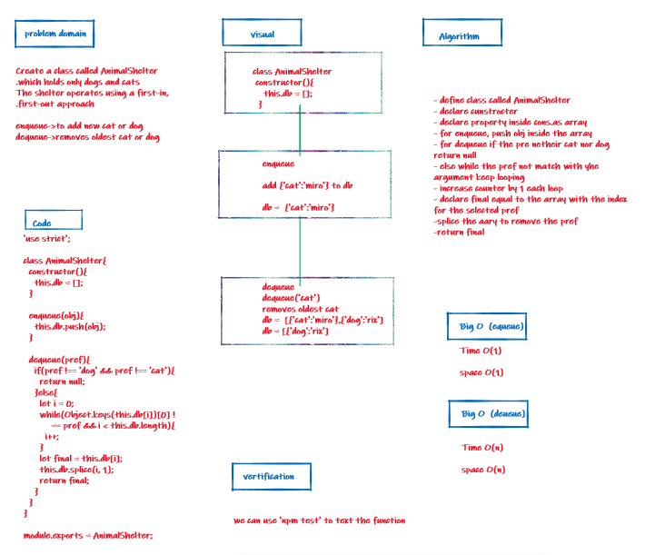

# stack-queue-animal-shelter

+ Code Challenges 12

## Challenge

Create a class called AnimalShelter which holds only dogs and cats.

## Approach & Efficiency

I took the approach of minimizing big O space/time by keeping my functions simplistic and focused on only what was necessary to complete the task.
I add a new node with that value to the back of the queue with an O(1) Time performance.

## API

 ### Queue

- .enqueue();
 - adds a new node with that value to the back of the queue

- .dequeue();
 - Removes the node from the front of the queue

- .peek();
 - Returns Value of the node located at the front of the queue

- .isempty();
 - Returns boolean indicating whether or not the queue is empty

## whiteboard

