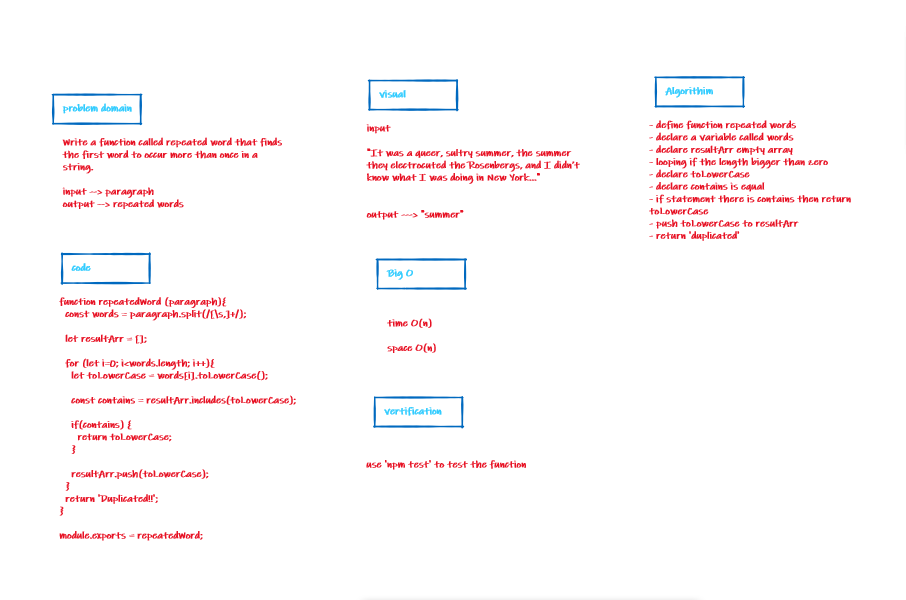

# Hashtables

+ Code Challenges 31

## Challenge

Write a function called repeated word that finds the first word to occur more than once in a string

## Approach & Efficiency

I took the approach of minimizing big O space/time by keeping my functions simplistic and focused on only what was necessary to complete the task.
I add a new node with that value to the back of the queue with an O(1) Time performance.

## UML
