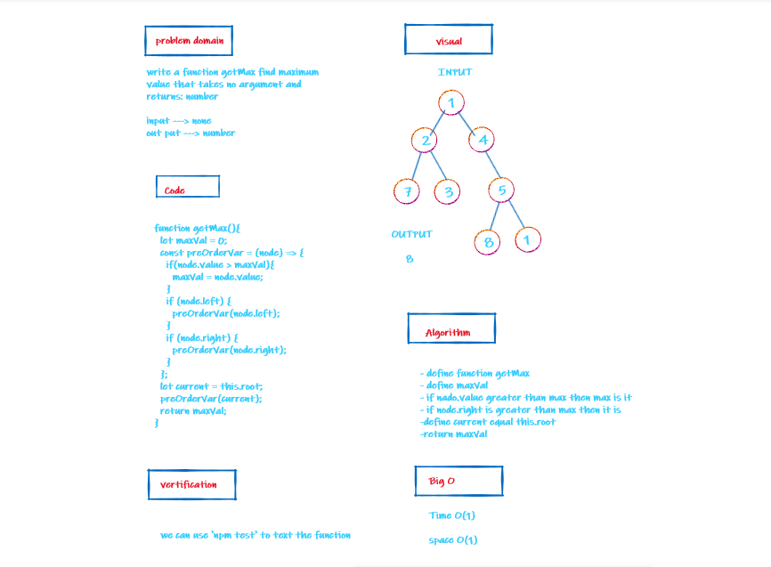
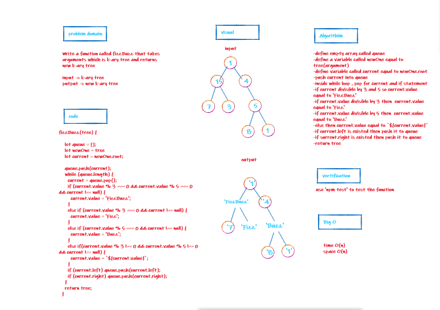

# Binary Tree and BST Implementation

+ Code Challenges 15
+ Code Challenges 16
+ Code Challenges 17
+ Code Challenges 18

## Challenge

Create a Binary Tree class using this methods : 
- pre order
- in order
- post order 
- getMax 
- breadthFirst 
- FuzzBuzz  

Create a Binary Search Tree using this methods :
- Add
- Contains

## Approach & Efficiency

I took the approach big O space/time by O(n) ,but for getMax method Big O was O(1).

## whiteboard

####  Code Challenges 16

####  Code Challenges 17 

####  Code Challenges 18 

