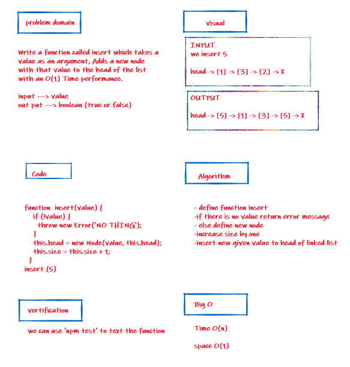
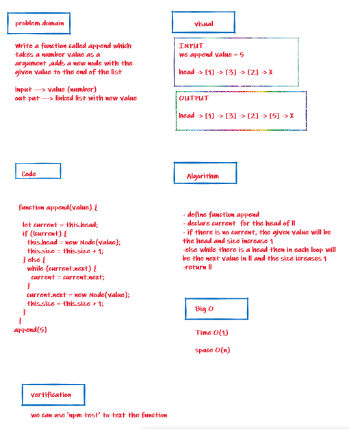
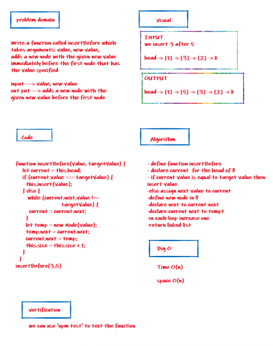
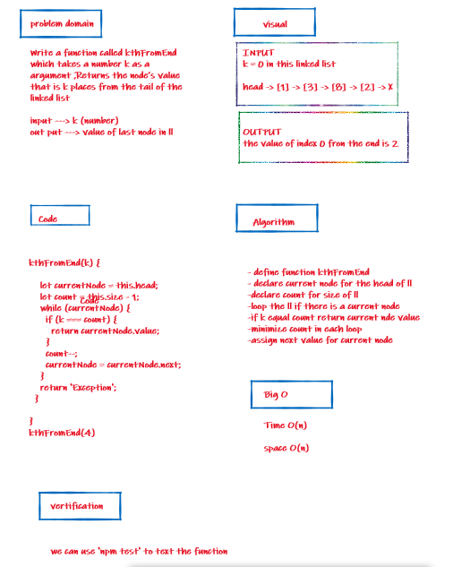
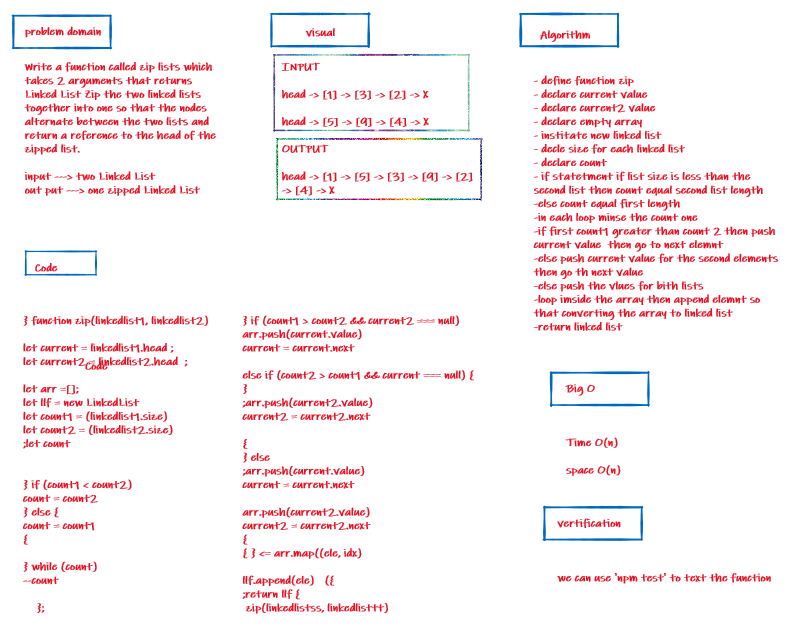

# Singly Linked List

+ Code Challenges 05 
+ Code Challenges 06
+ Code Challenges 07

## Challenge 05

* Challenge 05: Create three prototype functions for single linked list class; insert, include, and toString

### API

- .insert();
 - Insert a node at the beginning of a linked list

## Challenge 06

* Challenge 06: Create three prototype functions of linked list class; append, insert after, and insert before

 ### API
 
- .append()
  - Add a node to the end of the linked list with a specified value

- .insertBefore()
  - Insert a node with a given value before a specified node

- .insertAfter()
  - Insert a node with a given value after a specified node

## Challenge 07

* Challenge 07: Create a prototype function for finding the nth value from the end of a linked list

 ### API
 
  .kthFromEnd()
A function that finds the value kth from the end of the linked list

- .include();
  - Search for a value in a linked list and return true or false
  
- .toString()
  - Output a string of the contents of a linked list

## Challenge 08

* Challenge 08: linked-list-zip

 ### API
 
  .zip()
A function that zipped two linked lists

## Approach & Efficiency

I took the approach of minimizing big O space/time by keeping my functions simplistic and focused on only what was necessary to complete the task.
Big O space is O(1) and time is O(n);
