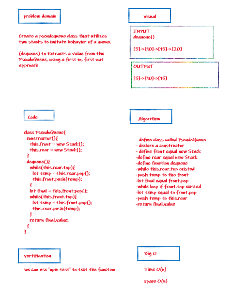
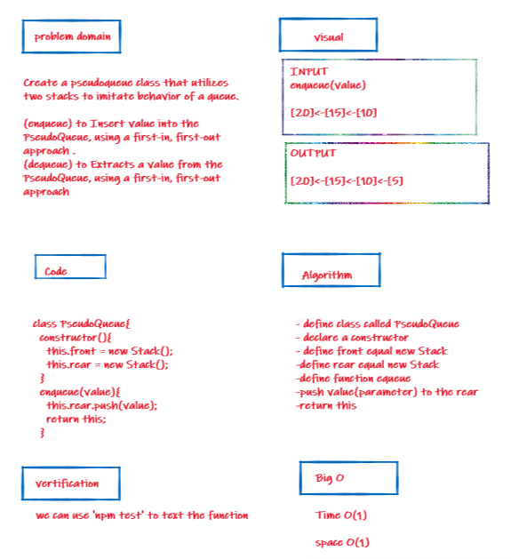

# stack-queue-pseudo

+ Code Challenges 11

## Challenge

Create a pseudoqueue class that utilizes two stacks to imitate behavior of a queue.

## Approach & Efficiency

I took the approach of minimizing big O space/time by keeping my functions simplistic and focused on only what was necessary to complete the task.
I add a new node with that value to the back of the queue with an O(1) Time performance.

## whiteboard

### dequeue method

### enqueue method

## API

### Stack 

- .push();
 - adds a new node with that value to the top of the stack 

 - .pop();
 - Removes the node from the top of the stack

 - .peek();
 - Returns Value of the node located at the top of the stack

 - .is empty();
 - Returns Boolean indicating whether or not the stack is empty

 ### Queue

- .enqueue();
 - adds a new node with that value to the back of the queue

- .dequeue();
 - Removes the node from the front of the queue

- .peek();
 - Returns Value of the node located at the front of the queue

- .isempty();
 - Returns boolean indicating whether or not the queue is empty

