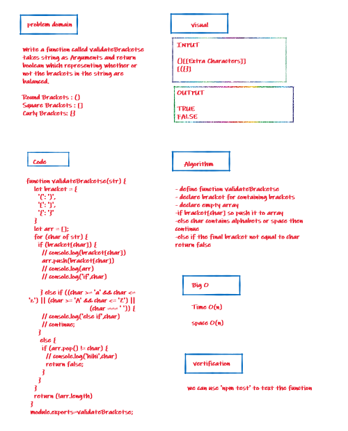

# stack-queue-animal-shelter

+ Code Challenges 13

## Challenge

Write a function called validate brackets takes string as Arguments and return boolean which representing whether or not the brackets in the string are balanced

## Approach & Efficiency

I took the approach of minimizing big O space/time by keeping my functions simplistic and focused on only what was necessary to complete the task.
I add a new node with that value to the back of the queue with an O(1) Time performance.

## whiteboard

